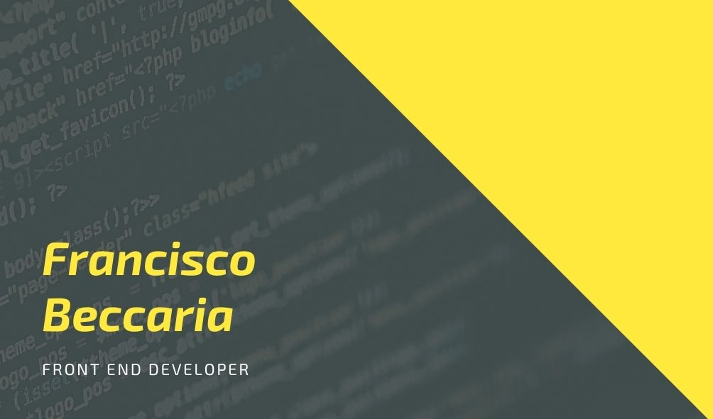

# Hola, Soy Francisco Beccaria! 👋

<!--## Skills ⚙️
* HTML
* CSS (Sass)
* JavaScript (Vanilla)
* GIT (GitHub)
* Firebase
* npm/yarn-->

## Soy un Front-End Developer 👨 💻

Actualmente estoy trabajando mis habilidades en React. Después de meses de trabajo considero que tengo buenas bases para empezar a trabajar con cualquier proyecto que requiera HTML, CSS (SASS), JavaScript Vanilla y Firebase.

### Contact

Puedes encontrarme en LinkedIn o en Twitter. Sino podemos enviarme un email. Actualmente estoy buscando trabajo como Jr. React - Front End.

<!--  -->

✉️ fbeccaria24@gmail.com

🌐 franciscobeccaria.com

<!--
**franciscobeccaria/franciscobeccaria** is a ✨ _special_ ✨ repository because its `README.md` (this file) appears on your GitHub profile.

Here are some ideas to get you started:

- 🔭 I’m currently working on ...
- 🌱 I’m currently learning ...
- 👯 I’m looking to collaborate on ...
- 🤔 I’m looking for help with ...
- 💬 Ask me about ...
- 📫 How to reach me: ...
- 😄 Pronouns: ...
- ⚡ Fun fact: ...
-->
